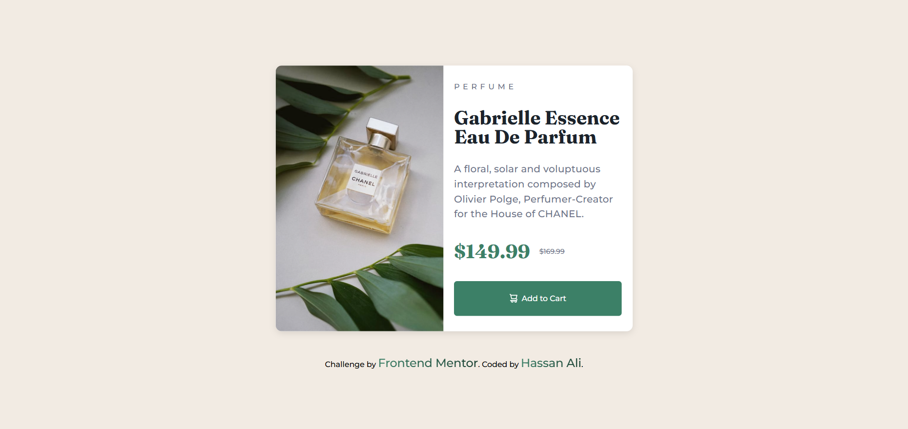
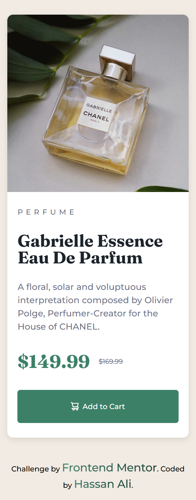

# Frontend Mentor - Product preview card component solution

This is my solution to the [Product Preview Card Component](https://www.frontendmentor.io/challenges/product-preview-card-component-GO7UmttRfa) on Frontend Mentor.  
Frontend Mentor challenges help you practice building realistic, production-ready web components.

---

## 📌 Overview

### 🔹 The Challenge

Users should be able to:

- View the **product preview card** layout optimally depending on their device's screen size.
- See hover and focus states for interactive elements.
- Read product details in a clean and accessible layout.

---

## 🖼️ Screenshots

### Desktop

### Mobile

---

## 🌐 Live Demo

👉 [View Live Demo](https://hassan-ali-byte.github.io/product-preview-card-component-main/)

---

## ⚙️ My Process

### Built With

- ✅ Semantic **HTML5 markup** (`<main>`, `<article>`, `<picture>`, `<footer>`)
- 🎨 **CSS custom properties (variables)** for colors, fonts, and spacing
- 📐 **Responsive units** (`em`, `rem`, `clamp`) and mobile-first workflow
- 🖼️ **Picture element** for responsive images
- 🎯 Accessibility features like `.sr-only` for screen readers
- ⚡ Modern CSS techniques: `object-fit`, `clip-path`, `flexbox`, and `grid`

---

## 📚 What I Learned

This challenge helped me solidify several important concepts:

- **Picture Element**:  
  I learned that the `<source>` tag doesn’t render images by itself — it just provides conditions. The actual `` element still does the rendering. This cleared up my misconception.

- **Accessibility**:  
  Practiced hiding content visually but keeping it in the DOM with `.sr-only` and `clip-path` for screen reader support.

- **Responsive Breakpoints with `em`**:  
  Instead of using `px`, I used `em` for breakpoints. This way, they scale relative to the user’s browser default font size, improving accessibility.

- **Object-fit for Images**:  
  Used `object-fit: cover` and `width/height: 100%` to avoid awkward cropping and make images fill their container naturally.

---

## 🔗 Resources

- [Josh Comeau – CSS Reset](https://www.joshwcomeau.com/css/custom-css-reset/)  
  For a modern and consistent base styling.

- [Kevin Powell – YouTube](https://www.youtube.com/@KevinPowell)  
  Learned practical tips on CSS, responsiveness, and modern best practices.

## 👨‍💻 Author

**Hassan Ali**

- Frontend Mentor – [@hassan-ali-byte](https://www.frontendmentor.io/profile/hassan-ali-byte)
- GitHub – [hassan-ali-byte](https://github.com/hassan-ali-byte)

---

✨ Thanks for checking out my solution!  
Feedback and suggestions are always welcome 🙌.
